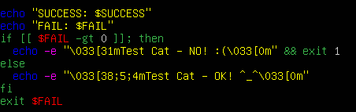
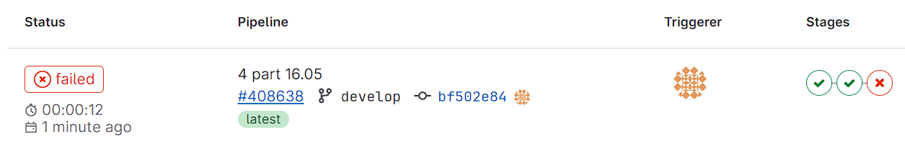
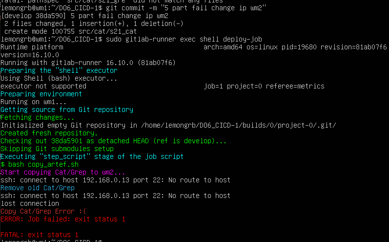

# DO6_CICD_s21_lemongrb

## Part 1. Настройка gitlab-runner

* Поднимем виртуальную машину Ubuntu Server 22.04 LTS:

  <div align=center>

  

  *Виртуальная машина wm1*
  </div>

* Скачаем и установим на виртуальную машину gitlab-runner с помощью команд:
  ```
   curl -L "https://packages.gitlab.com/install/repositories/runner/gitlab-runner/script.deb.sh" | sudo bash

   sudo apt-get install gitlab-runner
   ```

* Запустим gitlab-runner и зарегистрируем его для использования в текущем проекте (DO6_CICD) `sudo gitlab-runner register`. При регистрации воспользуемся токеном и URL на edu-платформе.

  <div align=center>

  

  *Зарегистрировали gitlab-runner*
  </div>
  

  <div align=center>

  

  *Вывод команды sudo gitlab-runner status*
  </div>


## Part 2. Сборка

**CI (Continuous Integration)** является практикой автоматизации сборки и тестирования кода каждый раз, когда разработчик вносит изменения в репозиторий. Это помогает обнаружить и исправить ошибки на ранних этапах разработки. 

Этап CI обычно включает в себя следующие шаги:

* Сборка кода: автоматическое создание исполняемого файла из исходного кода;
* Тестирование: автоматическое выполнение тестов для проверки корректности работы кода;
* Отчеты: сбор и визуализация результатов тестирования и других метрик качества кода;
* Развертывание: автоматическое развертывание протестированного кода на тестовых или промежуточных серверах.

Напишем этап для CI по сборке приложений из проекта C2_SimpleBashUtils:

* Скопируем папки с проектами cat и grep в src директорию DO6_CICD. Создадим файл .gitlab-ci.yml и добавим этап запуска сборки через мейк файл из проекта C2.

* Файлы, полученные после сборки (артефакты), сохраним в произвольную директорию со сроком хранения 30 дней:

  <div align=center>

  

  *Содержимое файла .gitlab-ci.yml*
  </div>


  **Артефакты (artifacts)** в контексте непрерывной интеграции и доставки (CI/CD) - это файлы или наборы файлов, которые генерируются в результате выполнения определенного этапа CI/CD пайплайна. Это могут быть исходный код, бинарные файлы, файлы конфигурации, журналы, отчеты о тестировании и т.д.

* Запушим файлы с cat, grep и .gitlab-ci.yml. Проверим сборку на GitLab, перед этим запустим gitlab-runner на машине wm1 `sudo gitlab-runner stop` и `sudo gitlab-runner run`:

  <div align=center>

  

  *Запустили gitlab-runner*
  </div>

* Проверим через gitlab-runner, что данный этап **build-job** для CI проходит сборку `sudo gitlab-runner exec shell build-job`:

  <div align=center>

  

  *Этап сборки на машине wm1 успешно пройден*
  </div>

* Заглянем в раздел проекта CI/CD в GitLab:

  <div align=center>

  

  *Отчет по успешной сборке в GitLab*
  </div>

## Part 3. Тест кодстайла

* Напишем этап для CI, который запускает скрипт кодстайла (clang-format). Если кодстайл не прошел, то «зафейлим» пайплайн. Дополним содержимое файла .gitlab-ci.yml новым этапом **style_test** - проверка стиля. Поставим данный этап перед сборкой:

  <div align=center>

  

  *Содержимое .gitlab-ci.yml с этапом проверки стиля кода*
  </div>

  **allow_failure: false** говорит о том, что при отрицательном результате данного этапа, следующий этап не начнется, пайплайн зафейлится.

* <div align=center>

  

  *Содержимое скрипта style_check.sh для проверки clang-format*
  </div>

* Специально изменим src/grep/grep.c - добавим лишние пробелы, чтобы `sudo gitlab-runner exec shell style-job` вывел ошибку. Предварительно закоммитим изменения: 

  <div align=center>

  

  *Ошибка этапа проверки стиля кода, дальнейший этап приостановлен*
  </div>

* Добавим и запушим src/grep/s21_grep.c и .gitlab-ci.yml в репозиторий. Запустим `sudo gitlab-runner run`. Проверим ошибку в CI/CD разделе на GitLab:

  <div align=center>

  

  *Пайплайн завален*
  </div>

  <div align=center>

  

  *style-job завалена*
  </div>

* Теперь исправим файл src/grep/s21_grep.c, убрав пробелы, и снова проверим стилевой этап с помощью `sudo gitlab-rubber exec shell style-job`:

  <div align=center>

  

  *Этап проверки стиля кода пройден*
  </div>

* Запушим файл src/grep/s21_grep.c, запустим `sudo gitlab-runner run` и проверим результат проверки стиля и сборки на GitLab:

  <div align=center>

  

  *Пайплайн не завален*
  </div>

  <div align=center>

  

  *Этап проверки стиля кода пройден*
  </div>

## Part 4. Интеграционные тесты

* Напишем этап для CI, который запускает интеграционные тесты cat и grep. Запустим этот этап автоматически только при условии, если сборка и тест кодстайла прошли успешно. Если тесты не прошли, то «зафейлим» пайплайн. Добавим новые записи по этапу тестов в .gitlab-ci.yml, напишем скрипт to_test_cat.sh (и grep) для запуска скрипта в gitlab-runner:

  <div align=center>

  

  *Содержимое .gitlab-ci.yml с этапом проверки тестов*
  </div>

  <div align=center>

  

  *Содержимое скрипта to_test_cat.sh для запуска скрипта тестов run_test.sh*
  </div>

* Добавим в конец скрипта с тестами `run_test.sh` строчки с условием "зафейленного" выхода:

  <div align=center>

  

  *Новые дополнительные строки в конце скрипта run_test.sh*
  </div>

* Закоммитим измененные и добавленные файлы и запустим `sudo gitlab-runner exec shell tests-job` выводит ошибку - ошибки в grep:

  <div align=center>

  

  *Ошибка этапа тестов в grep, дальнейшее выполнение приостановлено*
  </div>

* Добавим и запушим src/grep/s21_grep.c и .gitlab-ci.yml в репозиторий. Запустим `sudo gitlab-runner run`. Проверим ошибку в CI/CD разделе на GitLab:

  <div align=center>

  

  *Пайплайн завален*
  </div>

  <div align=center>

  

  *tests-job завалена*
  </div>

* Теперь исправим ошибки в grep, закоммитим изменения и снова проверим этап тестов с помощью `sudo gitlab-rubber exec shell tests-job`:

  <div align=center>

  

  *Этап проверки тестов пройден*
  </div>

* Запушим изменения, запустим `sudo gitlab-runner run` и проверим результат проверки стиля, сборки, тестов на GitLab:

  <div align=center>

  

  *Пайплайн не завален*
  </div>

  <div align=center>

  

  *Этап тестов пройден*
  </div>

# Part 5. Этап деплоя

* Напишем этап для CD, который «разворачивает» проект на другой виртуальной машине. CD (Continuous Delivery, непрерывное развертывание). CD позволяет ускорить процесс развертывания программного обеспечения и улучшить его качество, снизив риск ошибок и проблем. Это также позволяет разработчикам сосредоточиться на разработке новых функций и улучшении существующего кода, а не на ручном развертывании изменений в рабочей среде.

  CD включает в себя:

  * Автоматическое развертывание изменений в коде в тестовой среде;
  * Автоматическое тестирование изменений в коде в тестовой среде;
  * Автоматическое развертывание изменений в коде в рабочей среде;
  * Автоматическое мониторинг и откат изменений в коде в рабочей среде.


* Поднимем вторую виртуальную машину Ubuntu Server 22.04 LTS:
  <div align=center>

  

  *Новый клон wm2*
  </div>

* С помощью проекта DO2_LinuxNetwork настроем внутреннюю сеть между wm1 и wm2 и добавим статический маршрут с сохранением от одной машины к другой (добавим записи в файл /etc/netplan/00-installer-config.yaml и после перезапустим `sudo netplan apply` - применим текущую конфигурацию сети, сохраненную в файле yaml):

  <div align=center>

  

  *Внутреняя сеть local_network из машин wm1 (192.168.0.11) и wm2 (192.168.0.12)*
  </div>

  <div align=center>

  

  *Содержимое файлов /etc/netplan/00-installer-config.yaml на wm1 и wm2*
  </div>

* Воспользуемся командой `sudo su` на wm1 для переключения на учетную запись суперпользователя (root) в системе Linux. Сгенерируем ключ SSH `ssh-keygen` для подключения ко второй виртуальной машине wm2 без пароля.

* Также в режиме суперпользователя скопируем открытый ключ с wm1 на wm2 (ip wm2: 192.168.0.12): `ssh-copy-id lemongrb@192.168.0.12` + введем пароль от wm2. Выйдем из режима, прописав `exit`. Перезагрузим ssh и gitlab-runner: `sudo service ssh restart` и `sudo service gitlab-runner restart`.

* Повторим два предыдущих шага для пользователя gitlab-runner на wm1: `sudo su gitlab-runner` + `ssh-keygen` + `ssh-copy-id lemongrb@192.168.0.12`. Также перезагрузим службы после изменений.

* На wm2 выдадим права администратора пользователю lemongrb на папку - `sudo chmod 777 /usr/local/bin/` для того, чтобы мы смогли сразу скопировать по scp файлы s21_cat/grep в нужную локацию /usr/local/bin/.

* Выполним команду на wm2 `sudo visudo` - она используется для редактирования файла конфигурации sudo. Чтобы разрешить выполнение команд без пароля для определенного пользователя или группы пользователей, необходимо отредактировать этот файл. Чтобы разрешить выполнение команд без пароля для пользователя lemongrb, необходимо добавить следующую строку в файл конфигурации sudo: `lemongrb ALL=(ALL) NOPASSWD: ALL`.

* Напишем bash-скрипт, который при помощи ssh и scp копирует файлы, полученные после сборки (артефакты), в директорию /usr/local/bin второй виртуальной машины:

  <div align=center>

  

  *Содержимое скрипта copy_artef.sh для копирования s21_cat и s21_grep на wm2 по ssh*
  </div>

  * Опция `-o StrictHostKeyChecking=no` отключает проверку подлинности хоста и автоматически добавляет новый ключ хоста в список известных хостов.
  * Команда `scp` (secure copy) используется для копирования файлов между локальной системой и удаленной системой через протокол SSH. Опция `-p` сохраняет временные метки, права доступа и атрибуты файлов при копировании. Это означает, что все атрибуты файла, включая время создания, время последнего изменения, права доступа и т.д., будут сохранены при копировании.


* В файле .gitlab-ci.yml добавим этап запуска написанного скрипта. Запустим этап CD вручную (manual) при условии, что все предыдущие этапы прошли успешно. В случае ошибки «зафейлим» пайплайн:

  <div align=center>

  

  *Этап деплоя в .gitlab-ci.yml*
  </div>

* Специально изменим ip-адрес wm2 на неправильный в copy_artef.sh. Закоммитим изменения и запустим `sudo gitlab-runner exec shell deploy-job`:

  <div align=center>

  

  *Ошибка этапа деплоя, дальнейшее выполнение приостановлено*
  </div>

* Запушим последний коммит в репозиторий. Запустим `sudo gitlab-runner run`. Проверим ошибку в CI/CD разделе на GitLab:

  <div align=center>

  

  *Этап деплоя ждет запуска вручную*
  </div>

  <div align=center>

  

  *Пайплайн завален*
  </div>

  <div align=center>

  

  *deploy-job завалена*
  </div>

* Теперь вернем ip wm2 обратно, закоммитим изменения и снова проверим этап тестов с помощью `sudo gitlab-rubber exec shell deploy-job`:

  <div align=center>

  

  *Этап деплоя пройден*
  </div>

* Запушим изменения, запустим `sudo gitlab-runner run` и проверим результат проверки всех этапов на GitLab:

  <div align=center>

  

  *Пайплайн не завален*
  </div>

  <div align=center>

  

  *Все этапы CI/CD пройдены*
  </div>


## Part 6. Дополнительно. Уведомления

* Настроем уведомления о успешном/неуспешном выполнении пайплайна через бота с именем «lemongrb DO6 CI/CD» в Telegram. 

  >Текст уведомления должен содержать информацию об успешности прохождения как этапа CI, так и этапа CD.

* Создадим бота Lemongrb DO6 CI/CD в Телеграме через BotFather:

  <div align=center>

  

  *Создание бота Lemongrb DO6 CI/CD*
  </div>

* Узнаем id пользователя Телеграм, которому будут приходить оповещения от бота: напишем новому боту что-либо, далее перейдем по адресу, подставив токен бота, который ранее выдал BotFather: `https://api.telegram.org/bot<Bot_token>/getUpdates`. Далее в json-ответе найдем значение chat-id, это и будет являться искомым id.

* Создадим bash-скрипт send-bot.sh, который будет вызывать API Telegram и отправлять нам сообщение через созданного бота:
  <div align=center>

  

  *Содержимое скрипта send-bot.sh*
  </div>

  * GitLab Runner предоставляет множество переменных окружения, которые можно использовать в скриптах и конфигурационных файлах конвейера. Эти переменные содержат информацию о проекте, конвейере, задаче, коммите и других аспектах выполнения конвейера.

    Вот некоторые из переменных окружения, которые предоставляет GitLab Runner:

    * CI_PROJECT_NAME: название проекта;
    * CI_JOB_STAGE: название этапа, на котором выполняется задача;
    * CI_PROJECT_URL: URL-адрес проекта;
    * CI_PIPELINE_ID: уникальный идентификатор пайплайна;
    * CI_JOB_STATUS: статус текущего этапа пайплайна.

  * `curl` - это утилита командной строки для передачи данных между клиентом и сервером с использованием различных протоколов, таких как HTTP, HTTPS, FTP, SFTP и других;
  * Опция `-s` в команде curl означает "silent mode" (тихий режим). Эта опция отключает вывод информации о процессе передачи данных в стандартный вывод, включая сообщения об ошибках;
  * Опция `--max_time` максимальное время ожидания ответа от сервера в секундах;
  * Опция `-d` в команде curl используется для отправки данных на сервер с помощью метода HTTP POST.

* Добавим исполнение написанного скрипта после выполнения каждого этапа CI/CD (after_script) в .gitlab-ci.yml:

  <div align=center>

  

  *Добавили after_script после каждого этапа*
  </div>

* Сделаем ошибку в этапе проверки стиля (style-job), закоммитим и запушим изменения. Проверим Pipeline в Gitlab и оповещение в чат-боте в Телеграм:

  <div align=center>

  

  *Пайплайн завален*
  </div>

  <div align=center>

  

  *Этап проверки стиля кода завален*
  </div>

  <div align=center>

  

  *Отрицательное уведомление в Телеграм от бота*
  </div>

* Исправим стиль в s21_cat.c, закоммитим и запушим изменения. Проверим GitLab и Телеграм снова:

  <div align=center>

  

  *Пайплайн не завален*
  </div>

  <div align=center>

  

  *Последний этап deploy успешно пройден*
  </div>

  <div align=center>

  

  *Положительное уведомление в Телеграм от бота*
  </div>

